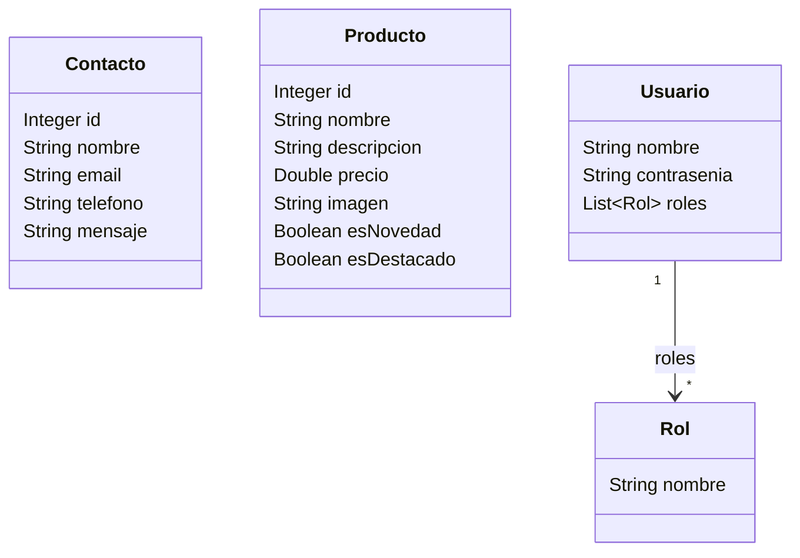

# Yoga en Equilibrio 3.0

## Yoga en equilibrio
##### Conectá cuerpo y mente con productos pensados para vos

---

Proyecto de desarrollo del backend de una página web para vender productos relacionados con yoga.

El frontend, se realizó en base al proyecto React realizado para el curso de React JS (<https://github.com/RodrigoFernandez/yogaenequilibrioReact>), que a su vez fue realizado en base a la página desarrollada para el curso de HTML, CSS y Javascript (<https://github.com/RodrigoFernandez/yogaenequilibrio>).


### Backend

El backend se realizó utilizando SpringBoot, con una base de datos MariaDB.

Y se agregó la configuración necesaria para compilar el proyecto React, al momento de compilar el proyecto java, para generar en el compilado del proyecto la lógica de backend y frontend.

También se agregó la configuración necesaria para el manejo del CORS.

#### Diagrama de clases



#### Construido usando las bibliotecas

* spring-boot-starter-data-jpa
* spring-boot-starter-webmvc
* lombok
* mysql-connector-j

#### Pruebas servicio Rest

En la carpeta `backend/docs` están los archivos de pruebas al servicio rest, utilizando Bruno API Client.

### Frontend

El sitio consta de las siguientes secciones:

* Inicio
* Productos
* Carrito de compras
* Sobre yoga en equilibrio
* Contacto

Una vez dentro de la aplicación, si el usuario tiene permisos de administrador, en el menú desplegable sale el opción Stock, que permite la administración de los productos usados en la aplicación.

#### Construido usando

* HTML
* CSS
* React

##### Paleta de colores
```
--color-texto: #3B3B3B;
--color-texto-error: #FF6B6B;
--color-fondo: #FDFDFD;
--color-fondo-header-footer: #CDB4DB;
--color-fondo-section: #D8A7B1;
--color-fondo-boton: #F6E7D7;
--color-fondo-card: #C4BDBA;
```

##### Fuentes
```
--fuente-principal: 'Playfair Display', serif;
--fuente-secundaria: 'Nunito', sans-serif;
```

#### Sitios de referencia 
* https://yogaexperiencias.com/yoga/accesorios-practica-yoga/
* https://yogaexperiencias.com/minerva-robles/
* https://www.axayoga.com.ar/tienda-de-yoga/
* https://yogamat.com.ar/accesorios/


#### Usuarios para autenticación

Los usuarios disponibles, para simular la autenticación, son:

| Usuario | Contraseña | roles |
|---|---|---|
| admin | adminpass | admin, user |
| user1 | pass1 | user |
| user2 | pass2 | user |
